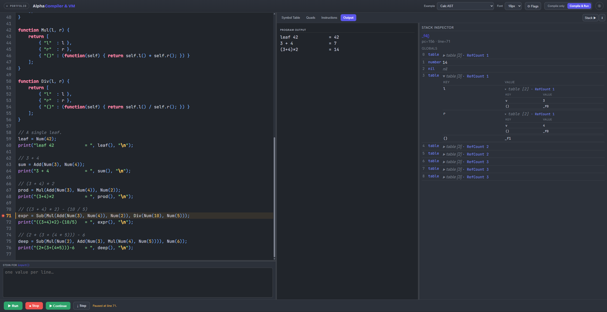

# Alpha Compiler & VM

> A complete compiler and virtual machine for a dynamically-typed scripting language — written from scratch in C.

**[→ Try the live playground](https://mikegiannako.github.io/portfolio/alpha_page/)** — run and inspect Alpha programs in your browser without a build toolchain.



---

## What is Alpha?

Alpha is a dynamically-typed scripting language designed for the **HY-340 Programming Languages** course at the **University of Crete, Department of Computer Science**. It features first-class functions, associative tables, and a set of built-in library functions. This repository contains every layer of the implementation: from source text through intermediate representation to a typed binary format, executed by a custom virtual machine.

---

## Compiler pipeline

| Stage | Component | What it does |
|---|---|---|
| **Lexer** | Flex (`lex.l`) | Tokenises source; handles strings with escape sequences and arbitrarily nested block comments |
| **Parser** | Bison (`parser.y`) | Parses Alpha grammar and drives semantic checks: scope resolution, loop nesting, undeclared symbols |
| **Symbol table** | `symtable.c` | Hash-table with chained scopes; tracks globals, locals, formals, and 12 built-in library functions |
| **Quad generator** | `quad.c` | Emits three-address intermediate code with backpatch lists for short-circuit `and`/`or` and `break`/`continue` |
| **Instruction generator** | `instruction.c` | Lowers quads to a typed instruction set and serialises the result to a `.bin` binary |
| **Virtual machine** | `avm_dispatcher.c` | Executes the binary; typed value stack, call stack, and reference-counted tables for garbage collection |

The compiler and VM are separate binaries. The compiler reads `.alpha`/`.asc` source and writes a `.bin`; the VM reads the `.bin` and executes it.

---

## Language features

```alpha
// Functions are first-class values — pass and return them like any other type
function apply(f, x) { return f(x); }
function double(x)   { return x * 2; }
function square(x)   { return x * x; }

print(apply(double, 7), "\n");   // 14
print(apply(square, 7), "\n");   // 49

// Associative tables
person = [ "name": "Ada", "year": 1815 ];
print(person.name, " (", person.year, ")\n");  // Ada (1815)

// Recursive functions
function fib(n) {
    if (n <= 1) return n;
    return fib(n-1) + fib(n-2);
}
print(fib(10), "\n");  // 55
```

Tables can also hold methods. The `..` operator invokes a member function and passes the object as an implicit first argument (`self`):

```alpha
function newCounter(start) {
    return [
        { "n"   : start },
        { "inc" : (function(self) { self.n = self.n + 1; }) },
        { "get" : (function(self) { return self.n; }) }
    ];
}
c = newCounter(0);
c..inc(); c..inc(); c..inc();
print("count: ", c..get(), "\n");  // count: 3
```

**Built-ins:** `print`, `input`, `typeof`, `totalarguments`, `argument`, `objectmemberkeys`, `objecttotalmembers`, `objectcopy`, `strtonum`, `sqrt`, `cos`, `sin`

---

## Building and running

Requires `gcc`, `flex`, `bison`, `make`. The build targets Linux/WSL (use `wsl.exe` on Windows).

```bash
make compiler          # → Compiler/build/compiler
make vm                # → VM/vm
make clean             # remove all build artifacts
```

Compile a source file and run it:

```bash
# One step: build, compile, and run
make run test=custom_tests/Phase5/advanced/oop_methods.asc

# Or separately
Compiler/build/compiler input.asc           # → output.bin (default)
Compiler/build/compiler input.asc out.bin   # explicit output name
VM/vm output.bin
```

`make run` shows only the program output. `make debug` dumps the full compilation pipeline — symbol table, quads, and instructions — to `debug.out`, and the VM instruction trace and stack state to `debug.log`.

Given this source:

```alpha
function power(base, exp) {
    result = 1;
    i = 0;
    while (i < exp) {
        result = result * base;
        i = i + 1;
    }
    return result;
}

print("2^8 = ", power(2, 8), "\n");
print("3^4 = ", power(3, 4), "\n");
```

The instruction output (after lowering from quads):

```
inst#   opcode        result          arg1            arg2            line
--------------------------------------------------------------------------
1:      jump          (label),24                                      1
2:      funcenter     (userfunc),0                                    1
3:      assign        (local),0       (number),0                      2
4:      assign        (local),1       (local),0                       2
5:      assign        (local),2       (number),1                      3
6:      assign        (local),1       (local),2                       3
7:      if_less       (label),9       (local),2       (formal),1      4
8:      jump          (label),11                                      4
9:      assign        (local),1       (bool),1                        4
10:     jump          (label),12                                      4
11:     assign        (local),1       (bool),0                        4
12:     if_eq         (label),14      (local),1       (bool),1        4
13:     jump          (label),21                                      4
14:     mul           (local),3       (local),0       (formal),0      5
15:     assign        (local),0       (local),3                       5
16:     assign        (local),4       (local),0                       5
17:     add           (local),5       (local),2       (number),0      6
18:     assign        (local),2       (local),5                       6
19:     assign        (local),3       (local),2                       6
20:     jump          (label),7                                       7
21:     assign        (retval),0      (local),0                       8
22:     jump          (label),23                                      8
23:     funcexit      (userfunc),0                                    9
24:     pusharg                       (number),2                      11
25:     pusharg                       (number),3                      11
26:     call                          (userfunc),0                    11
27:     assign        (global),0      (retval),0                      11
28:     pusharg                       (string),0                      11
29:     pusharg                       (global),0                      11
30:     pusharg                       (string),1                      11
31:     call                          (libfunc),0                     11
32:     assign        (global),1      (retval),0                      11
33:     pusharg                       (number),4                      12
34:     pusharg                       (number),5                      12
35:     call                          (userfunc),0                    12
36:     assign        (global),0      (retval),0                      12
37:     pusharg                       (string),0                      12
38:     pusharg                       (global),0                      12
39:     pusharg                       (string),2                      12
40:     call                          (libfunc),0                     12
41:     assign        (global),1      (retval),0                      12


 Table of Constants
---------------------
Strings:
0: \n
1: 2^8 = 
2: 3^4 = 

Numbers:
0: 1.000000
1: 0.000000
2: 8.000000
3: 2.000000
4: 4.000000
5: 3.000000

User Functions:
0: power

Library Functions:
0: print
```

Every operand carries its storage class — `(formal)`, `(local)`, `(global)`, `(number)`, `(bool)`, `(string)`, `(userfunc)`, `(libfunc)`, `(retval)` — so the VM resolves each argument from the correct frame slot or constant pool without any runtime tag on the instruction itself. For example, instruction 14 (`mul (local),3 (local),0 (formal),0`) reads `result` from local slot 0, `base` from formal slot 0, and writes the product to local slot 3 — all purely by position.

Program output:

```
2^8 = 256
3^4 = 81
```

For instruction-level tracing and stack inspection:

```bash
make debug test=path/to/file.asc   # full pipeline dump; stdout → debug.out, stderr → debug.log
VM/vm --trace output.bin           # trace each instruction as it executes
VM/vm --dump  output.bin           # trace + full stack dump at every step
```

---

## Error messages

The compiler distinguishes user-facing source errors from internal developer errors. User-facing messages include the source file, line, and column, and are colour-coded in the terminal (red for errors, orange for warnings, blue for the location):

```
[SYNTAX ERROR] - User Function `f` has already been declared in the same scope | funcdecl_shadowing.alpha:7:14

[SYNTAX WARNING] - Symbol `x` is unreachable as there is at least one active User Function between it and the point of reference | unreachable_symbol_within_func.alpha:13:13
```

Runtime errors from the VM report the source line where execution failed:

```
about to add a number and a table
[VM ERROR] - Arithmetic operation on non-number types: 'number' and 'table' at line 8
```

---

## Memory safety

All heap allocations go through safe wrappers in `common/memory_operations.h`:

```c
safeCalloc(num, size, "allocating symbol table entry")
safeRealloc(ptr, newSize, "growing quad array")
safeFree(&ptr, "freeing string buffer")
safeStrDup(src, "duplicating identifier name")
```

Each call takes a description string and automatically captures the call site via `__FILE__`/`__LINE__`, so any allocation failure pinpoints exactly what was being allocated and where. `safeFree` nullifies the pointer after freeing. The compiler is built with `-fsanitize=address` in all configurations.

---

## Compiler flags

Three code-generation behaviours can be toggled at compile time via the `FLAGS=` make variable:

| Flag | Default | Effect |
|---|---|---|
| `--funcstart-jump` / `--no-funcstart-jump` | on | Emit an unconditional jump at each function definition to skip the body during sequential execution |
| `--return-jump` / `--no-return-jump` | on | Emit an explicit jump at every `return` site |
| `--short-circuit-backpatch` / `--no-short-circuit-backpatch` | off | Implement `and`/`or` short-circuit evaluation as control-flow edges via backpatch lists |

```bash
make run test=myfile.asc FLAGS="--no-funcstart-jump --short-circuit-backpatch"
```

---

## Use of AI / LLMs

Three parts of this project were created with the assistance of **Claude Sonnet**:

- **The entire frontend of the linked web playground** — the editor UI, inspection tabs, stack visualiser and step debugger UI were generated by Claude Sonnet. The backend (compiler and VM compiled to WebAssembly) is hand-written C; the frontend that drives it is AI-generated.
- **Warning on unused return values** — the analysis that detects when a function call's return value is used by the caller while the function body contains no `return` statement was implemented with Claude Sonnet's assistance.
- **WebAssembly build chain** - I was not familiar with emscripten well enough to create a build chain that also includes the compilation of Lex and Yacc/Bison but after reading the produced bash file I got a pretty good idea of the gerneral process and look forward into implementing it on my own the next time.

Everything else — the lexer, parser, symbol table, intermediate code generator, instruction emitter, and VM — was written by hand.

---

## Project context

Implemented alongside the **HY-340 Programming Languages** course at the University of Crete, Department of Computer Science. Every component — lexer, parser, symbol table, intermediate code generator, instruction emitter, and VM — was written from scratch in C, using only Flex and Bison as external tools. The implementation reflects my own reading of the spec, not official course material.
